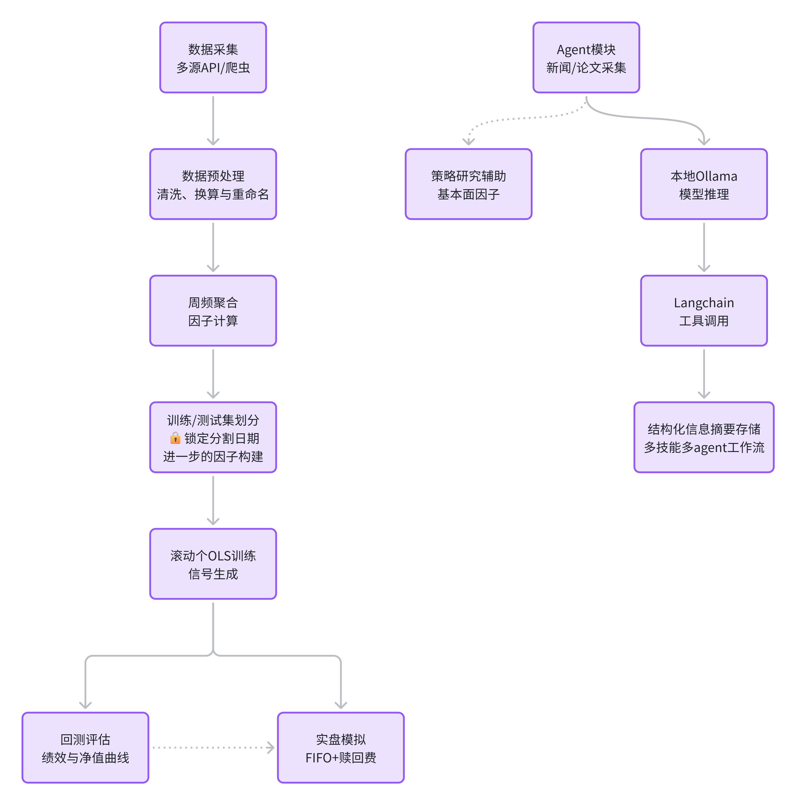
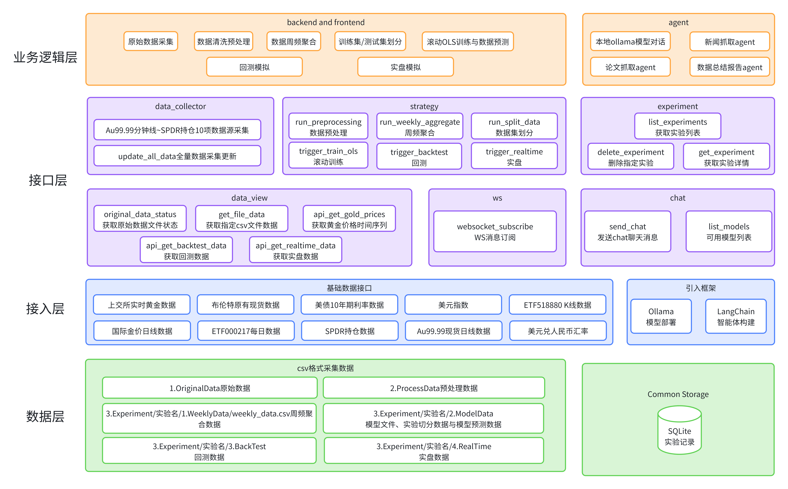

# Strategy Forge

一个个人量化策略研究平台，专注于**黄金 ETF 联接基金（000217）的趋势择时策略**。  
涵盖多源数据采集、因子工程、滚动训练、回测评估、实盘模拟（含交易费用）的全流程。通过前后端分离的 Web 应用提供交互式操作与可视化分析。

---

## 项目状态

- ✅ 全流程贯通：数据采集 → 预处理 → 周频聚合 → 数据分割 → 滚动训练 → 回测 → 实盘模拟  
- ✅ 增量训练：锁定分割日期，追加新数据信号，历史结果不变  
- ✅ 多维分析：回测绩效、净值/回撤曲线、买卖点标记、实盘账户快照、信号分布  
- ✅ 实时通知：WebSocket 推送任务完成/失败，前端自动刷新与提示  
- 🔜 Agent 模块：基于 LangChain + Ollama 的黄金基本面分析 Agent，可采集新闻、论文并生成研报（规划中）

---

## 技术栈

| 层   | 技术                                                        |
|------|-------------------------------------------------------------|
| 前端 | Vue 3 (Composition API), Vite, TypeScript, Element Plus, ECharts, Axios, WebSocket |
| 后端 | FastAPI (Python 3.13+), pandas, scikit‑learn, statsmodels, SQLite |
| 数据 | akshare, yfinance, fredapi, tickflow, 华尔街见闻 K线, GoldAPI 等 |
| 策略 | 滚动 OLS + Z‑Score 信号，多因子（金价、美元指数、美债、原油、SPDR 等） |
| Agent |	LangChain, Ollama (本地模型), DuckDuckGo 搜索等 |
---

## 主要功能

- **数据采集与预处理**  
  十余种黄金相关数据源，支持全量/增量更新，后台执行并实时通知。
- **策略实验管理**  
  每个实验独立目录，数据库记录完整生命周期，支持查看、删除、状态追踪。
- **滚动训练与信号生成**  
  首次全量训练或增量追加信号，窗口、阈值可配置，保留历史信号一致性。
- **回测分析**  
  策略净值、基准净值、绩效指标（夏普、最大回撤、年化收益）、买卖标记图表、交易明细。
- **实盘模拟**  
  初始 10000 元，按周五净值成交，FIFO 赎回规则，展示账户净值、现金/份额变化、基金净值曲线。
- **可视化仪表盘**  
  黄金多源价格对比，回测/实盘多图表（净值、回撤、仓位），交互式缩放与提示。
- **实时通知**  
  WebSocket 双向通信，任务完成后全局弹窗，实验流程自动联动。
- **智能 Agent（开发中）**  
  基于本地 Ollama 模型 + LangChain 框架，能够采集黄金相关新闻、基本面数据，自动分类事件类型并生成分析摘要，供其他模块调用。
---


## 免责声明与注意事项

### ⚠️ 投资风险
本项目仅用于 **学习、研究与技术交流**，**不构成任何形式的投资建议或策略参考**。  
历史回测和实盘模拟结果不代表未来表现，使用本代码产生的任何交易损失由使用者自行承担。

### 🔒 开源版本说明
如果您访问的是本项目的 **开源版本（strategy-forge-public）**，请注意：
- 已移除涉及敏感信息的爬虫代码（`backend/app/services/wallstreetcn_kline_utils.py`），该模块用于获取上海黄金交易所 **AU99.99 分钟级K线** 数据。
- 需要您自行编写数据获取代码，并替换 `backend/app/api/routes/data_collector.py` 中 `trigger_update_kline` 接口调用的服务。
- 获取到的数据应存放于环境变量 `DATA_DIR` 下的 `1.OriginalData` 目录，文件名为 `AU9999_SGE_10year_5min.csv`。
- **参考数据格式**（CSV 表头与示例）：

| tick_at | datetime | open_px | high_px | low_px | close_px |
|--------|----------------------|--------|--------|-------|----------|
| 1539368700 | 2018-10-13 02:25:00 | 271.86 | 271.86 | 271.86 | 271.86 |

请确保您的数据源能提供类似结构的分钟级数据，否则后续周频聚合将无法正常运行。

### 📦 依赖环境
- 后端和 Agent 模块共用同一 conda 环境，所有依赖见 `requirements.txt`。
- 请勿在公开仓库中提交任何 **API Key、数据库文件、个人数据** 等敏感信息。

---
## 安装与运行

### 后端

```bash
# 创建并激活虚拟环境（推荐 Python 3.13.5）
conda create -n strategy-env python=3.13.5
conda activate strategy-env

# 安装依赖（若重装环境可加 --force-reinstall 确保版本匹配）
pip install -r requirements.txt -i https://pypi.tuna.tsinghua.edu.cn/simple

# 启动服务
uvicorn app.main:app --reload --host 0.0.0.0 --port 8000
```

API 文档：`http://localhost:8000/docs`

### 前端

```bash
cd frontend
npm install
npm run dev
```

访问：`http://localhost:5173`

---

## Agent（开发中）
  Agent 模块位于 agent/ 目录，与后端共用同一 conda 环境。目前包含基于 LangChain + Ollama 的测试脚本，用于验证 Agent 工具调用与结构化输出能力。

```bash
# 确保已激活 strategy-env 环境
conda activate strategy-env

# 可选1：安装额外依赖（langchain 相关）
pip install -U langchain langchain-ollama langchain-community duckduckgo-search ddgs

# 可选2(推荐)：或者直接全量安装依赖，由于使用的是一套conda环境，agent模块和后端backend模块共用这套包环境
# agent模块和backend模块下均含有该requirement.txt文件
pip install -r requirements.txt

# 运行示例脚本
cd agent
python gold_news_agent.py
```
--- 

## 项目架构流程图


## 项目架构图

---
## 未来计划

- 🤖 完善 Agent 模块，实现黄金基本面新闻的自动采集、分类、摘要生成，并提供 API 供平台调用
- 🧠 构建训练相关知识 Agent，辅助模型调参、因子分析 
- ⚡ C++ 编译加速 OLS 模型训练，提升滚动回测效率
- 📈 扩展 Agent 能力：接入论文检索、多源数据对比、自动生成研报

---

*Strategy Forge — 锻造你的量化策略*